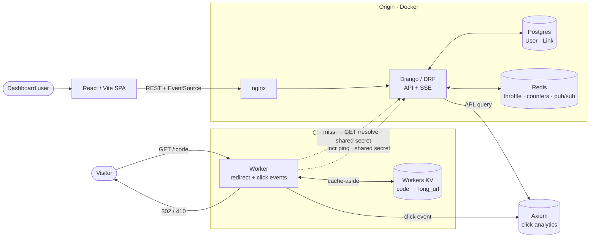
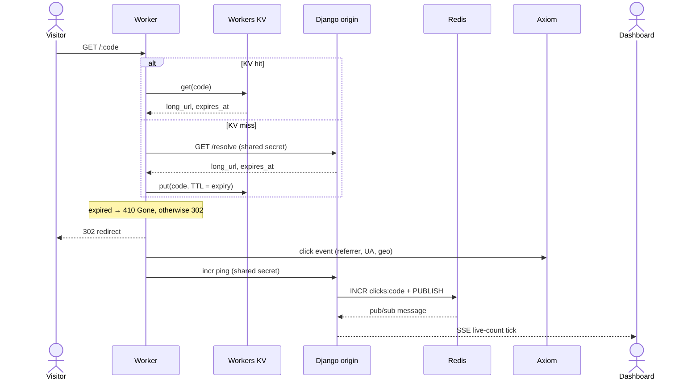

# URL Shortener — Production-Grade Build (Master Plan)

## Context
Career-relaunch build project (Day 2+). Two jobs at once: (a) a **production-grade portfolio piece** for the job search, and (b) a hands-on refresh of resume tech grounded in *recent* practice — stated goal is **interview confidence via industry practice**.

Build style: **"you code, I coach"** — user writes core logic, Claude explains-first then reviews. **TDD (red-green-refactor) + best practices throughout.** Phasing = **tracer-bullet** (Pragmatic Programmer): each phase is a *thin, working, tested, end-to-end slice* at production quality, never a throwaway prototype. Build *order* is phased, not build *quality*. Tech-decision rationale doc written at the end.

**Architecture is edge-first** — deliberately mirrors the user's real Proveway flagship (Cloudflare Worker + Axiom ingestion). Redirects + analytics run at the **edge**, not the origin. **SD basis:** `~/career-relaunch/system-design/01-url-shortener.md`; the "NoSQL KV" verdict is realized literally as **Workers KV at the edge**, while Postgres stays the relational source of truth for users/links.

## Locked decisions
**Stack:**
- **Origin (Dockerized):** Django + DRF · Postgres (users + links, source of truth) · Redis (DRF throttling + live-count counters + SSE pub/sub) · JWT (`simplejwt`) · `drf-spectacular` · pytest + factory_boy.
- **Edge:** Cloudflare **Worker** (TS) does the redirect · **Workers KV** = edge cache (cache-aside from origin) · fires click events to **Axiom** · pings origin for live count.
- **Analytics store:** **Axiom** (replaces a ClickEvent table + Celery analytics pipeline entirely).
- **Frontend:** React + TypeScript + Vite + React Query + React Router + Tailwind.
- **Live count:** Worker → origin increment endpoint → Redis → **SSE** → dashboard.
- **CI/CD:** GitHub Actions (pytest + Worker vitest + lint/type). *Deploy:* Worker → Cloudflare (wrangler); Django → AWS ECS/RDS/ElastiCache; secrets via Secrets Manager/SSM + **OIDC**.
- **Sentry** (origin + frontend + Worker). **Celery:** optional, housekeeping only (expired-row cleanup) — may be a mgmt-command+cron instead.

**Forks resolved:**
- Features: shorten + edge-redirect + analytics dashboards **+ custom aliases + link expiration**. **No anonymous shortening** → login required to create; redirect public.
- Auth: access token in memory + **refresh token in httpOnly, Secure, SameSite cookie, rotated** + blacklist on logout. Worker↔origin calls authenticated via shared secret.
- Analytics: edge → Axiom (full events: ts, code, referrer, UA/device, country via CF geo); dashboards query Axiom APL.
- Repo: **public**, monorepo.
- Secrets: django-environ (reads env) · `.env` gitignored (local) · Secrets Manager/SSM (prod) · GitHub Secrets + OIDC (CI) · Worker secrets via wrangler (Axiom token, shared secret).

## Architecture

Target design (includes the Phase 4 analytics/live-count paths).

### System topology


### Request flow — redirect (cache-aside) + click analytics + live count

**Data model (no ClickEvent — events live in Axiom):**
- `User` (email login).
- `Link`: `id` (bigint autoincrement = counter), `short_code` (unique, indexed; `base62(id)` or custom alias), `long_url`, `owner` FK, `created_at`, `expires_at?`, `is_active`.

**Code-gen (Strategy B — locked 2026-06-17, supersedes earlier base62(id) idea):** auto = **random base62** draw (`secrets.choice`, 7 chars), uniqueness enforced by the DB unique constraint + insert-layer retry on `IntegrityError`. Non-enumerable (codes don't leak row count or have an arithmetic link to `id`); no decode() — resolution is a plain string lookup. Rejected `base62(link.id)` (Strategy A) for guessability/enumeration. Custom alias = validate charset/length/reserved-words/uniqueness, same `code` column.

**Edge cache-aside:** Worker reads Workers KV; on miss calls origin `/resolve` (shared-secret auth), populates KV (value carries `expires_at`; KV TTL set to it). Postgres never on the redirect hot path after warm-up.

## Tracer-bullet phases
Each phase: tests-first, ends in a demoable end-to-end slice, CI green.

**Phase 0 — Walking skeleton (the tracer round).** Prove the whole multi-runtime stack lights up.
- Public repo, monorepo (`backend/ frontend/ worker/ nginx/`), conventional commits. docker-compose: web · db · redis · frontend.
- Django split settings (django-environ) · DRF · drf-spectacular `/api/schema`; pytest + factory_boy + coverage.
- Worker skeleton via **wrangler** + Miniflare local + a KV namespace; Worker `/health`.
- Axiom account + dataset + ingest token (user signs up; Claude guides).
- React shell + Tailwind + Router; calls `GET /api/v1/health` → `{status, db, redis}`.
- GitHub Actions CI: ruff/black/mypy + pytest + Worker vitest — green on PR #1.
- **Demo:** `docker compose up` → page "API healthy"; `wrangler dev` → Worker `/health` ok; CI green.

**Phase 1 — Core spine: create + edge redirect + event.**
- Django: `Link` model + base62 codec; `POST /api/v1/links` → 201 `{short_url}`; internal `GET /api/v1/links/{code}/resolve` → `{long_url, expires_at}` (for Worker KV miss).
- Worker: `GET /{code}` → KV get → miss → origin `/resolve` → populate KV → **302** (404 if absent); fire click event → Axiom (fire-and-forget).
- React: shorten form + result + copy (React Query `useMutation`).
- **TDD:** base62 encode/decode (unit) → create + resolve endpoints (APIClient) → Worker redirect + KV cache-aside (vitest + Miniflare, mock origin) → Worker→Axiom (mock fetch).
- **Demo:** create in UI → visit short link (Worker) → 302; event in Axiom; 2nd hit from KV (no origin call).

**Phase 2 — Auth (JWT, httpOnly refresh).**
- `User` + register/login/refresh/logout (simplejwt); access in body, refresh in httpOnly cookie + rotation + blacklist.
- `Link.owner` FK; create → `IsAuthenticated`; `/resolve` → Worker shared-secret; `GET /api/v1/links` owner-scoped, paginated. DRF throttling (anon+user).
- React: register/login, protected routes, auth context, React Query my-links, axios refresh-on-401.
- **TDD:** auth flows, ownership isolation, throttle, Worker→origin auth.
- **Demo:** register → login → create → my-links; logout clears refresh cookie.

**Phase 3 — Custom aliases + expiration.**
- Optional `custom_code` (validate + uniqueness vs auto-codes); `expires_at`; **expiry enforced at edge** — Worker reads `expires_at` from KV value → 410 Gone; KV TTL set to expiry.
- Housekeeping: Django mgmt command (cron) — or optional Celery beat — deactivates/cleans expired Postgres rows.
- React: alias input + expiry picker; handle 410.
- **TDD:** alias validation/collision, Worker 410 on expired KV value, cleanup job.
- **Demo:** `bit.ly/my-talk` expiring 1h → works, then 410.

**Phase 4 — Analytics dashboards (Axiom) + live count.**
- Worker enriches event (referrer, UA/device, CF geo `country`) → Axiom; **+ pings origin** `/api/v1/links/{code}/clicks/incr` (shared-secret) → Redis counter + pub/sub.
- Django: SSE stream endpoint (Redis pub/sub → live count); dashboard aggregates endpoints query **Axiom APL** (total, time-series, top referrers, geo), owner-scoped.
- React: analytics dashboard (React Query for Axiom aggregates) + live counter via `EventSource`. Sentry wired.
- **TDD:** Axiom query layer (mock Axiom API), aggregates correctness + owner-scoping, incr→Redis→SSE, Worker enrichment+ping (vitest).
- **Demo:** open dashboard, hit link from another tab → live SSE tick; charts from Axiom.

**Phase 5 — Hardening + deploy (production).**
- Security pass (the Django gap): HTTPS/HSTS, secure cookies, CORS allowlist, no raw SQL, explicit serializer fields (no `__all__`), dep scan, throttling; Worker↔origin shared secret; Axiom/CF tokens as secrets.
- Structured JSON logging; nginx SSE no-buffer + timeouts; gunicorn/uvicorn.
- Deploy: Worker → Cloudflare (`wrangler deploy`, prod KV namespace); Django → AWS ECS Fargate + RDS + ElastiCache + ALB + ECR; Secrets Manager/SSM env injection; CD via GitHub Actions **OIDC**; Worker secrets via wrangler.
- Load test (k6) — edge redirect throughput + origin API.
- **Demo:** public HTTPS app; edge redirects live; merge → OIDC deploy.

**Phase 6 — Tech-decision rationale doc.** `DECISIONS.md`: per tech — why chosen, alternatives rejected, trade-offs (incl. edge+Axiom vs in-DB ClickEvent, Workers KV cache-aside, live-count design). Feeds interview prep + Leitner cards.

## TDD workflow
- Red → green → refactor per unit.
- **Origin/React:** unit (base62, validators, serializers, Axiom-query layer) → API/integration (DRF `APIClient`) → e2e smoke (compose up). Frontend: Vitest + React Testing Library + MSW.
- **Worker:** vitest + Miniflare (emulates KV); mock origin `/resolve` + Axiom ingest.
- **Edge/SaaS caveat:** Worker + Axiom aren't in docker-compose — Worker via `wrangler dev`, Axiom via a free test dataset (or mocked). Django + React stay fully Dockerized.
- factory_boy + pytest fixtures; **coverage gate ≥90%** on app logic, enforced in CI.

## Best-practices checklist
Conventional commits (no Co-Authored-By) · 12-factor config + split settings · type hints + mypy / strict TS · `/api/v1` versioning + OpenAPI · ruff/black/isort + eslint/prettier · CI gates (lint+type+test+coverage) + branch protection · correct status codes (201/302/404/410) · pagination + throttling · secrets never committed · Docker multi-stage + non-root + healthchecks · reviewed migrations · Worker↔origin authenticated.

## Project structure
```
url-shortener/
  docker-compose.yml · nginx/nginx.conf · .github/workflows/{ci,cd}.yml · PLAN.md
  backend/ Dockerfile · config/settings/{base,dev,prod}.py · conftest.py · factories.py
    apps/links/{models,codec,serializers,views,tests}.py      # create, resolve, my-links
    apps/accounts/{models,auth,views,tests}.py                # JWT
    apps/analytics/{axiom_client,aggregates,sse,views,tests}.py  # Axiom queries, incr, SSE
  worker/  wrangler.toml · src/index.ts · test/ (vitest+miniflare)   # edge redirect + Axiom + ping
  frontend/ Dockerfile · src/{api,hooks,routes,pages,components}/
```
Greenfield — no existing code to reuse; needs a fresh Python venv (Django not in base interpreter), Node for Worker + frontend, a Cloudflare account (Workers + KV), and an Axiom account.

## Verification
- Per-phase demo (above) + CI green on every PR.
- Final: deployed HTTPS app (edge redirects + origin API), full end-to-end flow, k6 numbers, coverage report, `DECISIONS.md` complete.
```
